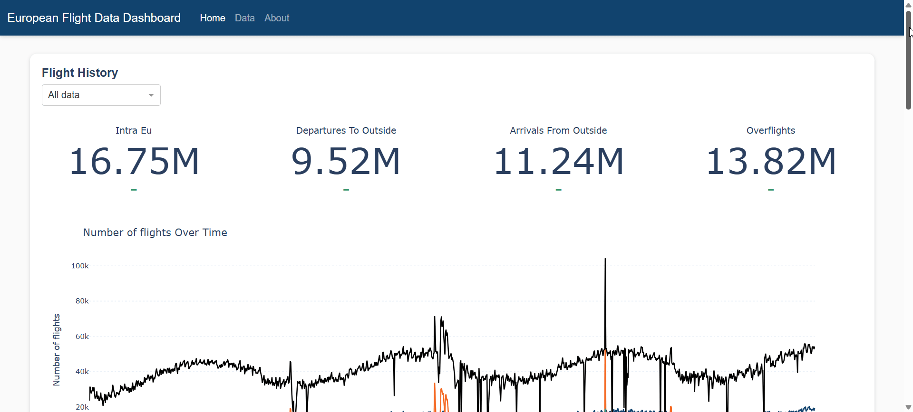
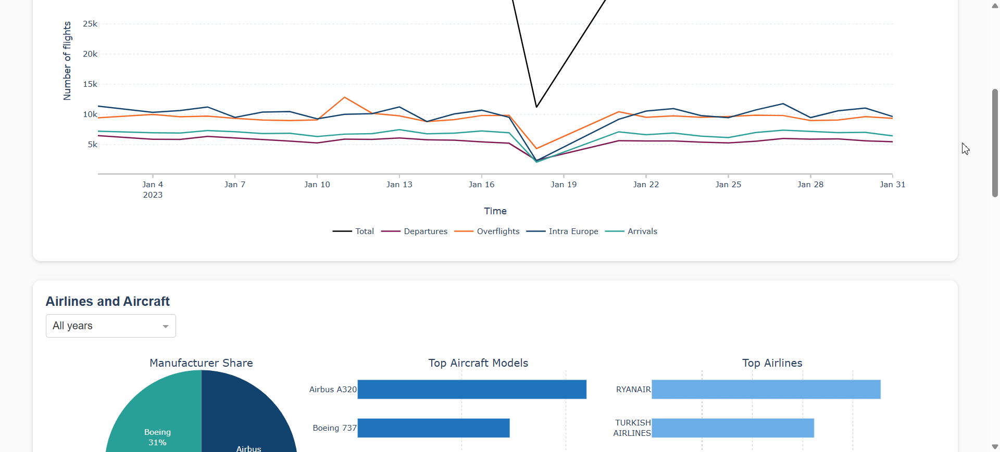
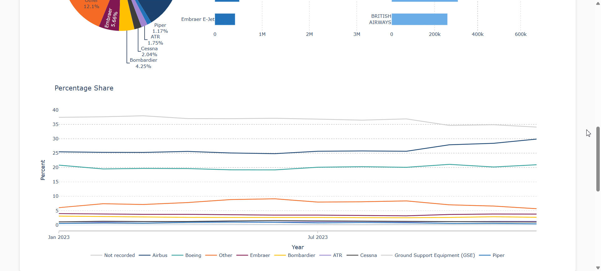

# European Flight Data Dashboard Portfolio Project 

An interactive portfolio dashboard to track European flight, aircraft and CO2 emission data. 

This project was built as a learning exercise to increase familiarity with:
- Python data manipulation
- SQL (PostgreSQL) and relational databases 
- Downloading data via APIs
- End-to-end data pipelines
- Database architecture
- Regex based text classification 
- Dashboard design
- Git and Github

### Usage 

 
 

 
 

### Roadmap
- [ ] Host dashboard 
- [ ] Add charts tracking most common departures and destinations 
- [ ] Add update script 
- [ ] Add tooltips

### Sources
Data source: [Eurocontrol Open Performance Data Initiative (OPDI)](https://www.opdi.aero/).

