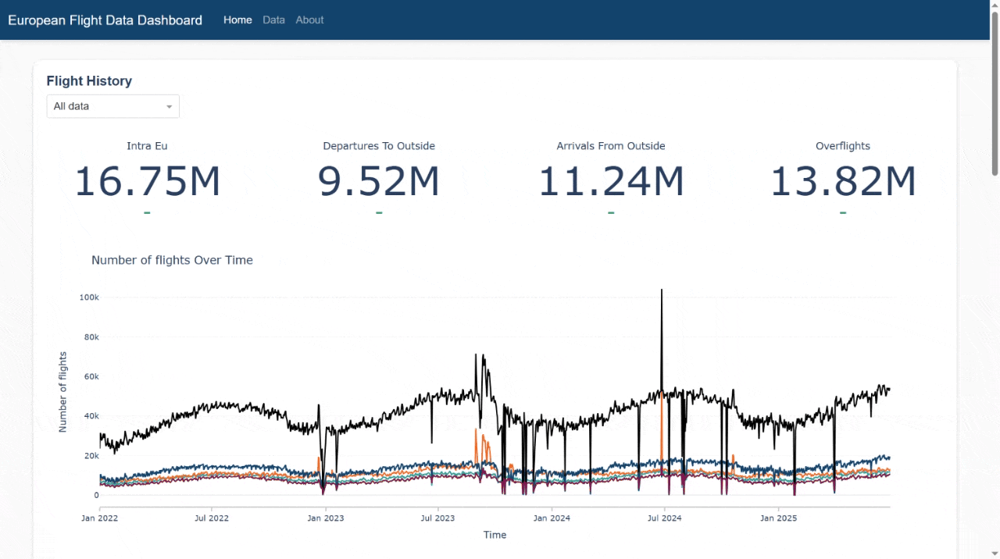

# European Flight Data Dashboard Portfolio Project 

An interactive portfolio dashboard to track European flight, aircraft and CO2 emission data. 

This project was built as a learning exercise to increase familiarity with:
- Python data manipulation
- SQL (PostgreSQL) and relational databases 
- Git and Github
- End-to-end data pipelines
- Database design
- Data ingestion and integration
- Dashboard design

### Usage 

### Roadmap
- [x] Host dashboard 
- [ ] Add charts tracking most common departures and destinations 
- [ ] Add update script 
- [ ] Add tooltips

### Sources
Data source is the [Eurocontrol Open Performance Data Initiative (OPDI)](https://www.opdi.aero/).

